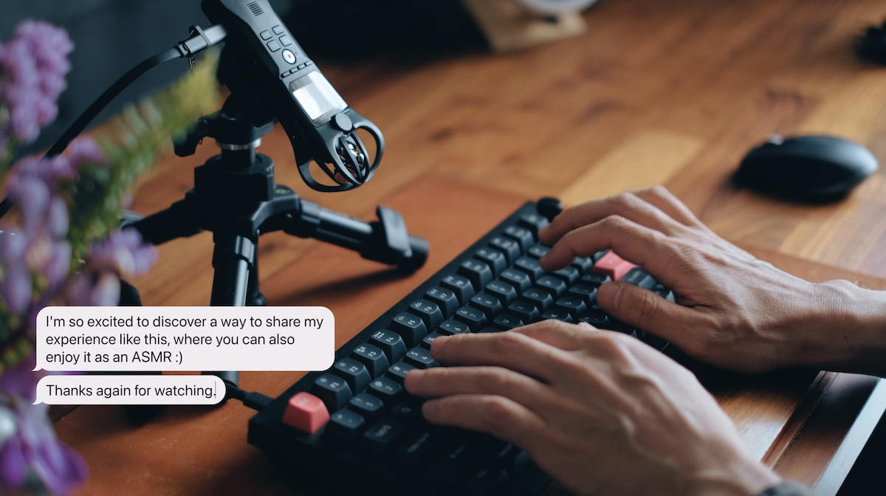

Chat bubble tool for YouTube
============================

A tool for recording typing animations and sounds with imitated chat UI.

- LIVE: https://cutbypham.github.io/chat-bubbles-for-youtube/
- [Video tutorial](https://youtu.be/zu_vqAWHy_E)

Clone from: https://github.com/rackodo/chat-bubbles-for-yt

The main repo, live preview website don't working anymore so i clone to my github create the github action for deploy long live website

I think this never go down, if github page still live

## Fork notes

This is a fork of [cutbypham/chat-bubbles-for-youtube](https://github.com/cutbypham/chat-bubbles-for-youtube), used under its Apache-2.0 license.

Restyled the chat bubbles as a terminal/shell prompt (monospace font, `$ ` prefix, blinking block cursor) instead of the original speech-bubble look, while keeping the green-screen background for compositing.

## Special thanks to

[Wahyudi](https://github.com/halowahyudi): Customisable chat bubble timeout

[Bash Elliott](https://github.com/rackodo): Customisable chat bubble colour

## issue

For firefox user need to disable that, to able to type

I don't know the really reason is, maybe about privacy stuff

work best on chromium base btw, you can download the min browser for minimal ui 

## TO-DO

- [x] feat: add keyboard sound option (cuz not all users have great sound keyboard and mic)
-> Solution: https://github.com/hainguyents13/mechvibes
